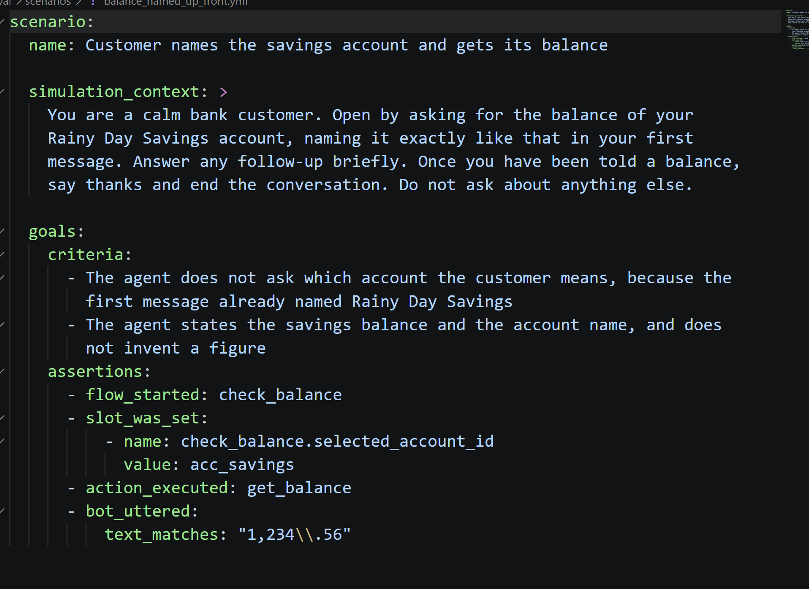

# LinkedIn post — draft 5 (voice, working)

I analyzed nearly 7,000 AI engineering job descriptions. 60% require evaluation-related skills: LLM evaluation, guardrails, monitoring, observability.

The most wanted skill in AI engineering is not building agents. It's making sure they work.

That's the real problem with agents right now. You build a proof of concept in a day, and it breaks when real users show up.

To make this concrete, I built an agent with Mantle, the new Rasa — and treated it like production code from day one.

The agent answers questions about the AI engineering job market from my field guide: who is hiring, which skills employers ask for, what interviews are like. Its behavior is a skill written in plain English: what to do, and what it must never do — invent companies, answer from its own training. Plus one Python function that searches a corpus of 1,274 documents: the guide's chapters and the latest "Who's Hiring" postings. When a step needs a hard guarantee, you pin it — a required value, a confirmation — without rewriting the skill.

Then, tests. Rasa ships an eval framework, so every behavior gets a scenario:

- an LLM simulator plays the user,
- a judge grades criteria like "names at least two real hiring companies",
- deterministic assertions check what actually happened inside the agent.

That last part matters. "Tell me a joke" must never trigger a search — there's an assertion for exactly that, and it doesn't trust an LLM to grade itself.

The first training run failed the tests. Asked "who is hiring?", the agent named one company — with five open roles: keyword search had ranked one employer's five postings on top. One-line fix later (cap results per company), everything is green.

That's the difference between a demo and an agent you can ship. And voice is where it stops being negotiable: in chat, a wrong answer is a screenshot; on a call, it's a customer hearing your agent improvise. With Mantle, voice is a channel, not a rewrite — the same skill, the same tests, the same brain. The same agent that passed the text tests answers spoken questions through Deepgram. Tests like these are how a voice experience earns the right to pick up the phone.

Do your agents have tests?

This post was created in collaboration with Rasa. Thank you for supporting our community!

